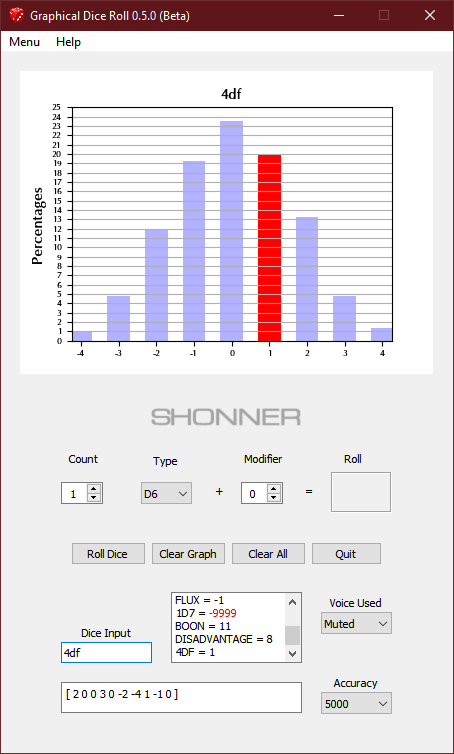

**Graphical Dice Roll Results for Python 3.9**
==============================================

**Graphical Dice Roll Results** is a Python 3.9 program for rolling various dice using PyQt5 and Matplotlib.

Some Things You Will Need
-------------------------

* **Windows 10**

  This code has not been tested on OSX or Linux.

* **Python 3.9**

  This code was written using Python 3.9.

* **PyQt5 5.15.4**

  PyQt5 is the framework used for displaying the Window GUI and buttons, etc.
   
* **numpy 1.20.2**

  For building arrays.

* **matplotlib 3.4.2**

  For graphics plotting.

* **pyttsx3 2.90**

  For the MS Zira and MS David voices.

Don't Have Python?
------------------

The .EXE version can be run in Windows 10.

.. |ss| raw:: html

    <strike>

.. |se| raw:: html

    </strike>

Things To-Do
------------

| Add more dice roll types.
| Instruction manual.
| Cheat codes.
|ss|

| Voice manual input roll results.
| Switch to using pydice 3.8 for die rolls.
| Secret roll types added.
| Add Advantage and Disadvantage roll types.
| Make it talk.
| Graph manually entered dice rolls as well.
| Start on a To-Do.

|se|

**Known History**

* v0.4.1b

  Increased error-trapping of any out-of-bound rolls during brute force percentage calculations.
  Roll results from manual inputs are now voiced as well.
  Number of dice and dice modifier ranges have been increased.

* v0.4.0b

  Now uses pydice 3.8 for its die rolling.
  Added error-trapping when performing **MINMAXAVG** rolls at the CMD prompt.
  Displays a sample of ten random rolls.

* v0.3.2b

  Fixed die roll range when adding a -DM to a roll.

* v0.3.1b

  Added secret rolls types based on the 4dF roll.

* v0.3.0b

  Added Advantage and Disadvantage roll types.
  
  .. image:: images/video.png
    :target: https://www.youtube.com/watch?v=89AzLRwAToU

* v0.2.0b

  It talks now.

* v0.1.0b

  Initial release.
  Graphing works with manual rolls also.

Contact
-------
Questions? Please contact shawndriscoll@hotmail.com
